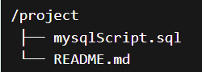
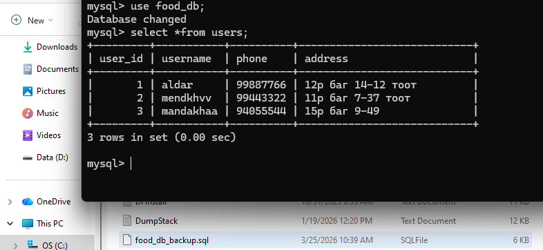

# Database project-[Food delivery system]

## Системийн тайлбар
Энэхүү төсөл нь хоол хүргэлтийн системийн өгөгдлийн санг зохион байгуулсан болно.

Систем нь дараах үндсэн хүснэгтүүдээс бүрдэнэ:
* Table 1: **Users**
* Table 2: **Restaurants**
* Table 3: **Orders**
* Table 4: **Deliveries**

Энэхүү хүснэгтүүд нь хоорондоо *Foreign Key* холбоотой бөгөөд бодит системийн өгөгдлийг хадгалах зориулалттай.

##  Ашиглах заавар (Run Instructions)
Дараах дарааллаар ажиллуулна:

1. MySQL server ажиллаж байгаа эсэхийг шалгана
2. mysqlScript.sql файлыг нээнэ.
3. Бүх кодыг нэг дор ажиллуулна.
Үүний үр дүнд:

* Database үүснэ
* Хүснэгтүүд үүснэ 
* Өгөгдөл орно
* Query -үүд ажиллана

## Файлын бүтэц

mysqlScript.sql файл нь дараах хэсгүүдээс бүрдэнэ:

* Database үүсгэх
* Хүснэгтүүд (PK, FK)
* Sample data (INSERT)
* Query-үүд (JOIN, GROUP BY)

## 4-р хэсэг: Онол
1. **Default утга гэж юу вэ?**
* Хүснэгтэд шинэ өгөгдөл нэмэх үед автоматаар оноогддог тогтмол утга.

2. **ORDER BY гэж юу вэ?**
* Өгөгдлийн эрэмбэлхэд ашиглана.

3. **Хандалт хязгаарлах нь яагаад чухал вэ?**
* Нууцлал хамгаалалд чухал
* Зөвхөн эрхтэй хүмүүс өөрчлөлт хийснээр санамсаргүй устахгүй ,алдагдахгүй

## 5-р хэсэг: Хэрэглэгч ба эрх

create user 'admin_user'@'localhost'
identified by 'Admin123';
grant all privileges on food_db.* to 'admin_user'@'localhost';

create user 'report_user'@'localhost'
identified by 'Readonly123';
grant select on food_db.* to 'report_user'@'localhost';

show grants for 'admin_user'@'localhost';
show grants for 'report_user'@'localhost';

## 6-р хэсэг: Backup & Restore

MySQL Command Line screenshot

## Оюутны мэдээлэл
* Нэр: О. Содончимэг
* Код: B232270067

Respository link: https://github.com/Sodonchimeg067/soril1